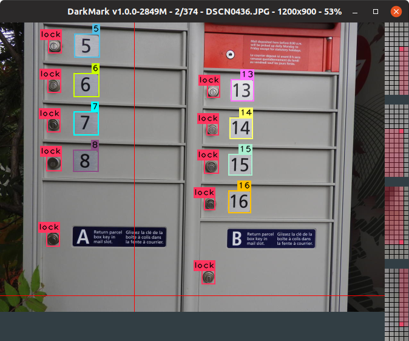
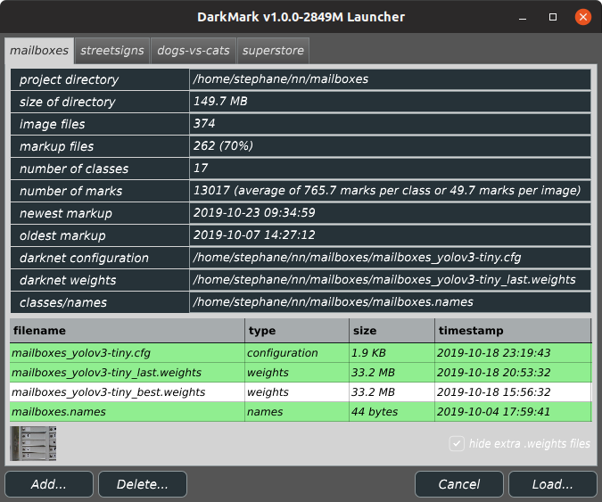
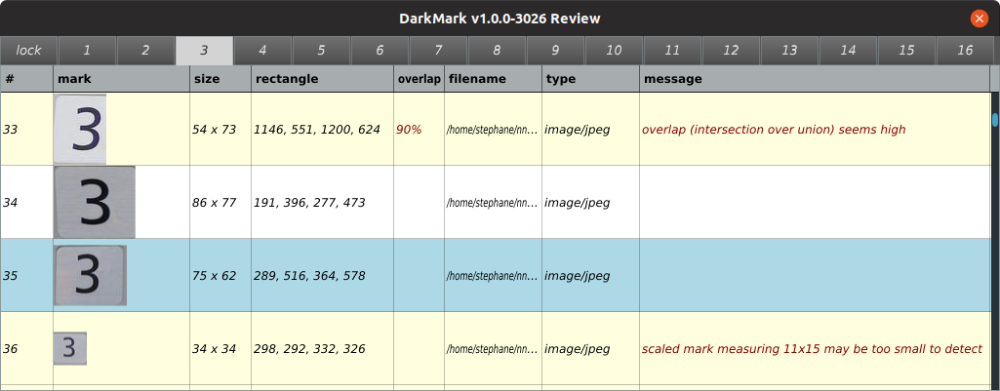
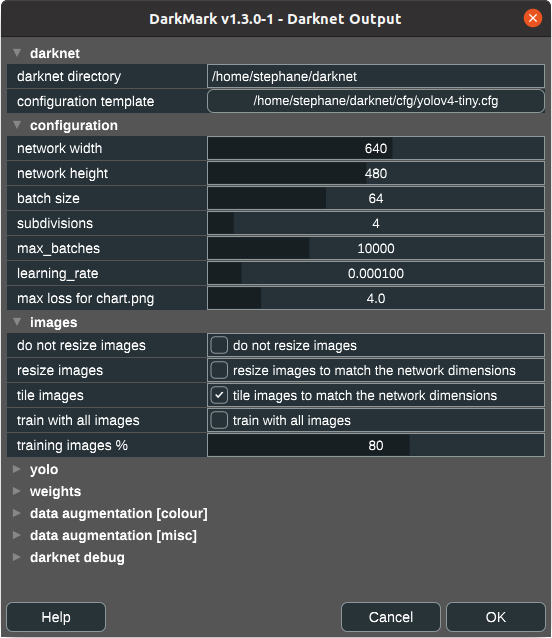
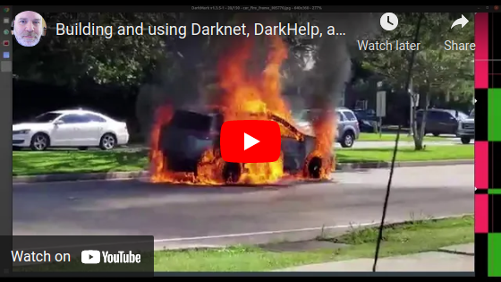

# What is DarkMark?

DarkMark is a C++ GUI tool used to annotate images for use in neural networks.  It was written specifically to be used with the [Darknet](https://github.com/AlexeyAB/darknet) neural network framework, and has several features tailored for use with Darknet and YOLO.

When you first launch DarkMark, you can specify a Darknet-style neural network to load with the selected project.  DarkMark uses that neural network to assist you in marking up more images.

Several different review capabilities exist to quickly review all the annotations and highlight some common errors.

Once ready, DarkMark can also be used to generate all of the Darknet and YOLO (or other) configuration files to train a new neural network.  This includes the modifications needed to the .cfg file, as well as the .data, training and validation .txt files.  DarkMark will also create some shell scripts to start the training and copy the necessary files between computers.

# License

DarkMark is open source and published using the GNU GPL v3 license.  See license.txt for details.

# How to Build DarkMark

Extremely simple easy-to-follow tutorial on how to build Darknet, DarkHelp, and DarkMark:

DarkMark requires [DarkHelp](https://github.com/stephanecharette/DarkHelp/) to build.  (And DarkHelp requires Darknet.)  So before you start building DarkMark, make sure you follow [the build instructions for DarkHelp](https://github.com/stephanecharette/DarkHelp/#how-to-build-darkhelp-linux).

Once Darknet and DarkHelp have been built and installed, run the following commands to build DarkMark on Ubuntu:

	sudo apt-get install build-essential cmake libopencv-dev libx11-dev libfreetype6-dev libxrandr-dev libxinerama-dev libxcursor-dev libmagic-dev libpoppler-cpp-dev
	cd ~/src
	git clone https://github.com/stephanecharette/DarkMark.git
	cd DarkMark
	mkdir build
	cd build
	cmake -DCMAKE_BUILD_TYPE=Release ..
	make
	make package
	sudo dpkg -i darkmark*.deb

# Doxygen Output

The official DarkMark documentation and web site is at <https://www.ccoderun.ca/darkmark/>.

Some links to specific useful pages:

- [DarkMark keyboard shortcuts](https://www.ccoderun.ca/darkmark/Keyboard.html)
- ["How To" on image markup](https://www.ccoderun.ca/darkmark/ImageMarkup.html)
- [Data augmentation in Darknet](https://www.ccoderun.ca/darkmark/DataAugmentation.html)
- [Darknet configuration files](https://www.ccoderun.ca/darkmark/Configuration.html)
- [Darknet FAQ](https://www.ccoderun.ca/programming/darknet_faq/)
- [Discord server for Darknet, YOLO, DarkHelp, and DarkMark](https://discord.gg/zSq8rtW)
